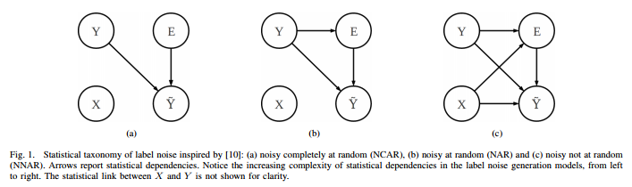
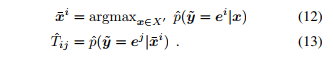
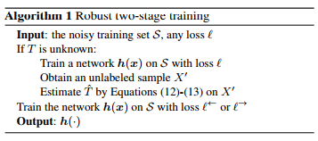
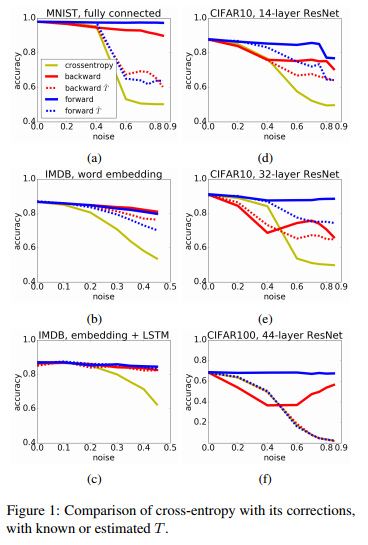

# Making Deep Neural Networks Robust to Label Noise: a Loss Correction Approach

* References
	* [pdf](http://giorgiopatrini.org/assets/paper/2017_CVPR.pdf)
	* [github](https://github.com/giorgiop/loss-correction)

## Summary
DNNでラベルノイズを軽減する手法を提案した。今までに未知であるノイズ推定の手法とノイズが既知である場合のラベルノイズの修正方法を組み合わせた。その中でActivationにrelu関数を用いた際には損失関数がノイズと独立していることを確認した。提案された手法を、MNISTをはじめとするデータセットで検証したら、精度が著しく向上したことを確認した。

## Objective of this thesis
Label Noiseが含まれているデータに対して効果的にDNNを適応できる手法を開発すること。

## Motivation
もともとIT広告のDSP事業のアナリストとして働いていて、コンバージョンをいかに取るのかという命題が与えられていたが、どうしても **コンバージョンタグをクリックのように設定する営業部隊が多く、ノイズが多くて学習がすすまない** 例が見受けられた。その結果の考察として、機械学習で重要なものは、データの質と量であるという点。そのために、分析前にノイズフィルタリングができるようなアルゴリズムを探している。

## Introduction
### [Label Noise](https://bfrenay.files.wordpress.com/2014/08/classification-in-the-presence-of-label-noise-a-survey.pdf) に関して
目的変数に対するノイズのこと。機械学習において致命的に精度を悪くしてしまうので、ラベルノイズを減らすことが重要だといわれている。この発生原因は以下の通り（野球で考えるとわかりやすい）

* ラベリング入力する人が信頼できない
  * 画像ラベリングをオフショアで行った場合とか、何も知らないアルバイトにやらせた場合
  * 審判の資格がない人が審判してストライクを取っても本当なのかわからない。
* 人為的なミスがある場合
  * プロでもミスすることはある。
  * アウトなんだけどセーフと言ってしまった場合
* ラベリングする人の基準の違い
  * 同じ意識を持つことは重要だが、どうしても人によって違いが生まれてしまう
  * 敷田直人なんかは **2ストライクになるとストライクゾーンがアウトコースに異様に広がる**
*  通信ミス
  * 通信ミスにより、ある値がnullになったり、異常値が検知される。
  * 審判が見ていないとか、ボールが審判にあたった、特殊な守備シフトを敷いたなど

　このLabel Noiseは数学的に3つに分類される。

* NCAR (Noisy Completely At Random Model)
  * エラーの発生がどの変数にも依存していない場合
* **NAR** (Noisy At Random Model)
  * エラーの発生が正常値に依存している場合。
  * 現実に一番近いので一番研究対象になっている
* NNAR (Noisy Not At Random Model)
  * エラー発生がすべてのパラメータ依存になっている場合
  * 現実的には考えにくいので、あまり考えられていない（らしい）

### ノイズを減らす方針
既往研究では、アーキテクチャレベルでノイズを減らす試みは一定の成果を上げている（ここら辺は詳しく見てない）。対して、もう一方の方法ではノイズが既知であるものとみなしてラベルノイズを訂正する方法がある。また、そもそものノイズ検知の未知のノイズを検10/25/2017 2:40:32 PM 知しようとする試みもあり、これらの方法論を組み合わせて、以下の手法を考えた。

* `backward correction` と `forward correction` だけでノイズ訂正ができる
* ノイズ推定を複数の目的変数がある場合でも可能にする。
* 上記のノイズ推定とライベルノイズ訂正を組み合わせる

# Label noise and loss robustness
上記のラベルノイズ分類のうち、比較的現実世界に近いNARを対象にしている。まずはT（ノイズ発生確率）が既知の場合に、手続きを4.1と4.2に示している。

### ノイズ発生確率が既知の場合
まず、ノイズ発生確率行列がわかっているので、その倒置行列を用いてbackward correction lossを定義している。エントロピーを使って、その値を最小にする値を決める戦略。これによって、行列式で簡単に修正分の損失を計算できる。これがbackward correction。
また、既知のノイズ発生確率Tがあった際に、上記のbackward correctionの逆を行えばforward correctionとなり、その次の層で発生しうるノイズがわかる。クロスエントロピを用いて情報量を計算しているが、そのリンク関数のsoftmaxが式展開の中で消されていって、ノイズにロバストであると主張している。

### ノイズ発生確率が未知の場合
事前にノイズ発生確率が既知であることは実世界においてまずないので、ノイズ発生確率を既往研究を元に推定する手法をアルゴリズム1の方法で提案した。また、この中でReLU関数をactivationに用いると、損失関数がノイズに依存しないので、良い方法だとしている。

# Experiments

MNIST, IMDB, CIFAR-10, CIFAR-100, Clothing1Mを検証対象にしているが、全般的によくなっているようだ。

# 感想
この場合では、DNNに組み込みやすいという点がメリットではある。しかしながら、他の分析手法と組み合わせたい場合のノイズ処理には向かないというお話だった。
